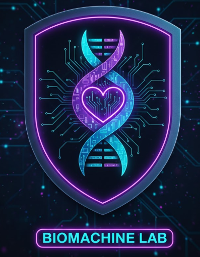

# 💜 Guía Educativa SOP - BiomaMachine Lab

<div align="center">



**Sofía** - Tu guía educativa sobre el Síndrome de Ovario Poliquístico

[](https://www.python.org/)
[](https://streamlit.io/)
[](https://groq.com/)
[](LICENSE)

</div>

---

## 🌟 Descripción

Un chatbot inteligente basado en IA que proporciona información educativa confiable y basada en evidencia científica sobre el **Síndrome de Ovario Poliquístico (SOP)**. 

Utiliza la **Guía Internacional de Práctica Clínica para el SOP (Monash 2023)** como fuente única de información, garantizando que todos los consejos sean precisos y actualizados.

---

## ✨ Características Principales

✅ **Información basada en evidencia** - Guía Monash 2023  
✅ **IA conversacional** - Respuestas naturales y empáticas  
✅ **Búsqueda de profesionales** - Encuentra ginecólogos, endocrinólogos, psicólogos y nutriólogos en tu zona  
✅ **15 temas predefinidos** - Acceso rápido a preguntas comunes  
✅ **Interfaz intuitiva** - Fácil de usar sin conocimientos técnicos  
✅ **Restricciones de seguridad** - Solo responde sobre SOP, redirige otros temas  
✅ **Historial de conversación** - Mantiene contexto entre preguntas  
✅ **Streaming de respuestas** - Efecto de escritura natural y fluida  

---

## 🚀 Tecnologías Utilizadas

| Tecnología | Propósito |
|-----------|----------|
| 🐍 **Python 3.9+** | Lenguaje principal |
| 🎨 **Streamlit** | Framework para la interfaz |
| 🤖 **Groq API** | Procesamiento con IA (Llama 3.3) |
| 📄 **PyPDF2** | Lectura de archivos PDF |
| 📚 **python-dotenv** | Gestión de variables de entorno |

---

## 📋 Requisitos Previos

Antes de comenzar, asegúrate de tener:

- Python 3.9 o superior instalado
- pip (gestor de paquetes de Python)
- Una API key de Groq (gratis en https://console.groq.com/)
- El archivo PDF de la guía SOP

---

## 🔧 Instalación

### 1️⃣ Clona el repositorio
```bash
git clone https://github.com/tu-usuario/SOP_CHALLENGE.git
cd CHAT_BOT
```

### 2️⃣ Crea un entorno virtual
```bash
# Windows
python -m venv .venv
.venv\Scripts\activate

# Mac/Linux
python3 -m venv .venv
source .venv/bin/activate
```

### 3️⃣ Instala las dependencias
```bash
pip install -r requirements.txt
```

### 4️⃣ Configura las variables de entorno
Crea un archivo `.env` en la raíz del proyecto:

```env
GROQ_API_KEY=tu_api_key_aqui
```

### 5️⃣ Prepara los archivos necesarios
```
CHAT_BOT/
├── bot3.0.py
├── guia_sop.pdf          ← Tu archivo PDF
├── logo.png              ← Tu logo
├── .env                  ← API key
├── requirements.txt
└── .venv/
```

### 6️⃣ Ejecuta la aplicación
```bash
streamlit run bot3.0.py
```

La aplicación se abrirá en `http://localhost:8501` 🌐

---

## 📖 Cómo Usar

### 🎯 Opción 1: Usar temas predefinidos
1. Abre la barra lateral
2. Selecciona un tema de la lista (ej: "¿Qué es el SOP?")
3. Haz clic en "📤 Preguntar"
4. ¡Sofía te responderá! 💬

### 💭 Opción 2: Hacer preguntas personalizadas
1. Escribe tu pregunta en el campo de entrada
2. Presiona Enter o haz clic en enviar
3. Recibe una respuesta personalizada basada en la guía

### 🗺️ Opción 3: Buscar profesionales
1. En la barra lateral, ingresa tu ciudad
2. Haz clic en los botones de Google Maps
3. Encuentra especialistas cercanos 📍

---

## 🎨 Temas Disponibles

| Emoji | Tema |
|-------|------|
| 🔍 | ¿Qué es el SOP? |
| 🩺 | ¿Cómo se diagnostica? |
| 💊 | Opciones de tratamiento |
| 🥗 | Alimentación saludable |
| 🏃‍♀️ | Actividad física |
| ⚖️ | Manejo del peso |
| 💉 | Resistencia a la insulina |
| 🤰 | Fertilidad y embarazo |
| 💇‍♀️ | Acné y vello excesivo |
| 📅 | Períodos irregulares |
| 🧠 | Salud emocional |
| ❤️ | Salud del corazón |
| 🩸 | Diabetes y SOP |
| 💊 | Anticonceptivos |
| 🌿 | Suplementos naturales |

---

## ⚙️ Configuración Avanzada

### Cambiar el modelo de IA
En el archivo `bot3.0.py`, busca:
```python
MODEL = "llama-3.3-70b-versatile"
```

Opciones disponibles en Groq:
- `llama-3.3-70b-versatile` (recomendado - más potente)
- `llama-3.1-70b-versatile`
- `llama-3.1-8b-instant` (más rápido)

### Ajustar tamaño de chunks del PDF
```python
chunk_size = 2000  # Aumenta o disminuye según necesites
```

### Personalizar prompts del sistema
Edita la función `create_prompt()` para cambiar el comportamiento de Sofía.

---

## 🔒 Restricciones de Seguridad

El bot está configurado con restricciones estrictas:

🚫 **Solo responde sobre SOP** - Rechaza preguntas sobre otros temas  
🚫 **Aclara que es exclusivo de mujeres** - Redirige a hombres  
🚫 **No da diagnósticos** - Siempre redirige a profesionales  
🚫 **No prescribe medicamentos** - Solo información educativa  
🚫 **Usa solo la guía** - No inventa información  

---

## 📦 Estructura del Proyecto

```
CHAT_BOT/
│
├── 📄 bot3.0.py                    # Archivo principal de la aplicación
├── 📊 guia_sop.pdf                 # Guía científica (Monash 2023)
├── 🖼️ logo.png                     # Logo de BiomaMachine Lab
├── 🔐 .env                         # Variables de entorno (no commitear)
├── 📋 requirements.txt             # Dependencias del proyecto
├── 📖 README.md                    # Este archivo
└── 🔑 .gitignore                   # Archivos a ignorar en Git
```

---

## 🐛 Solución de Problemas

### ❌ Error: "Logo no encontrado"
```
✅ Solución: Asegúrate de que logo.png esté en la misma carpeta que bot3.0.py
```

### ❌ Error: "No se encuentra guia_sop.pdf"
```
✅ Solución: Verifica que el PDF existe con ese nombre exacto
```

### ❌ Error de API Key
```
✅ Solución: Revisa tu archivo .env y que la clave sea válida
```

### ❌ La app se carga lentamente
```
✅ Solución: Reduce chunk_size o usa modelo más rápido (llama-3.1-8b-instant)
```

---

## 📝 Archivo requirements.txt

```
streamlit==1.28.0
groq==0.4.1
PyPDF2==3.0.1
python-dotenv==1.0.0
Pillow==10.0.0
```

Instala con:
```bash
pip install -r requirements.txt
```

---

## 🌐 Despliegue en la Nube

### Opción 1: Streamlit Cloud (Recomendado)
1. Sube tu proyecto a GitHub
2. Ve a https://share.streamlit.io/
3. Conecta tu repositorio
4. Configura las variables de entorno en Settings

### Opción 2: Heroku
```bash
heroku login
heroku create tu-app-sop
git push heroku main
```

### Opción 3: AWS, Google Cloud, etc.
Busca tutoriales específicos para Streamlit en cada plataforma.

---

## 👥 Contribuciones

¡Las contribuciones son bienvenidas! 🤝

1. Fork el proyecto
2. Crea una rama para tu feature (`git checkout -b feature/MiFeature`)
3. Commit tus cambios (`git commit -m 'Agrego MiFeature'`)
4. Push a la rama (`git push origin feature/MiFeature`)
5. Abre un Pull Request

---

## 📄 Licencia

Este proyecto está bajo la Licencia MIT. Ver el archivo [LICENSE](LICENSE) para más detalles.

---

## ⚠️ Disclaimer Legal

**IMPORTANTE:** Este chatbot es solo para fines educativos. 

🔴 **NO es un sustituto** de consulta médica profesional  
🔴 **NO diagnostica** condiciones médicas  
🔴 **NO prescribe** medicamentos o tratamientos  
🔴 **NO reemplaza** la opinión de un profesional de salud  

Siempre consulta con tu ginecólogo, endocrinólogo u otro profesional de salud para:
- Diagnóstico confirmado
- Opciones de tratamiento personalizadas
- Recomendaciones específicas para tu caso

---

## 📞 Contacto y Soporte

- 📧 Email: soporte@biomachinelab.com
- 🐛 Issues: [GitHub Issues](https://github.com/tu-usuario/SOP_CHALLENGE/issues)
- 💬 Discussiones: [GitHub Discussions](https://github.com/tu-usuario/SOP_CHALLENGE/discussions)

---

## 🙏 Agradecimientos

- ✨ **Groq** por la API de IA accesible
- 📚 **Monash University** por la Guía de Práctica Clínica
- 🎨 **Streamlit** por el framework increíble
- 💜 **Comunidad SOP** por la inspiración

---

<div align="center">

### 💜 Hecho con amor para la comunidad SOP 💜

**BiomaMachine Lab** © 2024

[⬆ Volver al inicio](#-guía-educativa-sop---biomachine-lab)

</div>
